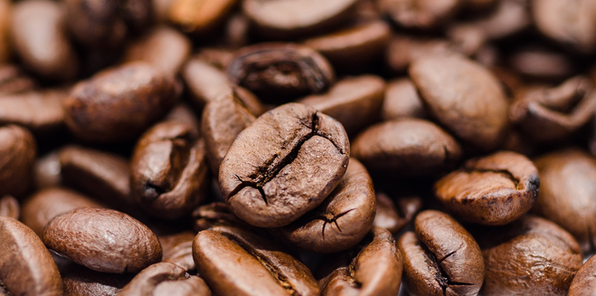

.. sphinx documentation master file, created by
   sphinx-quickstart on Fri Jun 11 21:25:54 2021.
   You can adapt this file completely to your liking, but it should at least
   contain the root `toctree` directive.

はじめに
==================================

コーヒーの世界へようこそ

   This is coffee

.. toctree::
   :maxdepth: 2
   :caption: Contents:

   01/about.rst

   02/history

   03/why-coffee

   sample.rst

.. note::
   これは注釈だよ

.. warning::
   これやらないでね

Indices and tables
==================

* :ref:`genindex`
* :ref:`modindex`
* :ref:`search`
